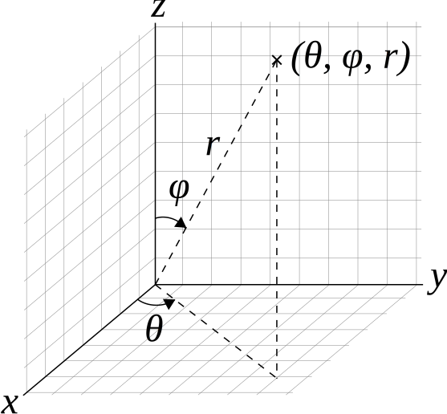

# Coordinate Conversions

The following image can explain the relation between cartesian and spherical representation.


Converting one coordinate to another coordinate is really easy. The system is developed in such a way that all the conversions are done implicitly.

## Example:
```c++
#include <iostream>
#include <boost/astronomy/coordinate/spherical_representation.hpp>
#include <boost/astronomy/coordinate/cartesian_representation.hpp>

typedef boost::astronomy::coordinate::spherical_representation spherical;

using namespace boost::astronomy::coordinate;

int main()
{
    cartesian_representation point1(10,20,30);

    //implicit conversion
    sphrcial_representation<degree> point2 = point1;

    spherical_representation<radian> point3(point1);

    //explicit conversion
    cartesian_representation point4 = static_cast<cartesian_representation>(point3);
    std::cin.get();
    return 0
}
```
[Previous](coordinate_point.md) | [Next](vector_operation.md)
